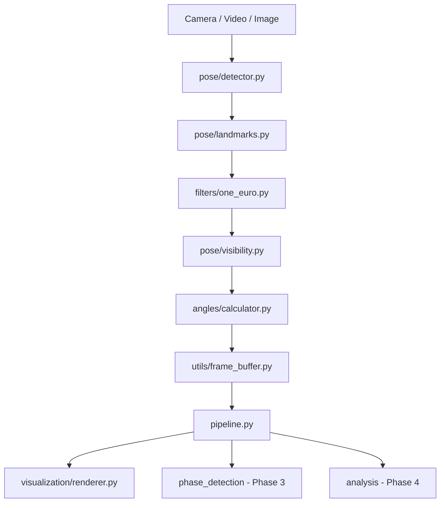

# Swichy Architecture

## What Changed

Phase 1 refactored Swichy from a flat `core/` prototype into a layered, production-oriented package structure:

| New Module | Purpose |
|------------|---------|
| [`pose/`](../pose/) | MediaPipe detector, landmark extraction (image + world), visibility gating |
| [`filters/`](../filters/) | One Euro Filter for real-time landmark smoothing |
| [`geometry/`](../geometry/) | 3D vector mathematics (rotation-invariant) |
| [`angles/`](../angles/) | Joint angle definitions and 3D calculator |
| [`pipeline.py`](../pipeline.py) | Central orchestrator connecting all stages |
| [`visualization/`](../visualization/) | Rendering only — no analysis logic |
| [`utils/`](../utils/) | Timestamps, config loading, frame buffer |
| [`config/`](../config/) | Settings + YAML configs |

The old `core/` package remains as **thin deprecation shims** pointing to the new modules.

---

## Why It Changed

### Problem with the old design

The original code mixed three concerns in one file (`core/drawing.py`):

1. **Detection visualization** (skeleton drawing)
2. **Angle computation** (2D trigonometry)
3. **Coaching logic** (elbow < 70° rule)

This made the system:

- **Untestable** — you could not verify angle math without opening an OpenCV window
- **Unreusable** — analysis could not feed a mobile app, API, or dashboard
- **Inaccurate** — 2D image-plane angles change when the camera rotates

### The new design principle: separation of concerns

```
Input (camera) → Pipeline (analysis) → Output (visualization + feedback)
```

Each layer has one job. The pipeline produces a `FrameResult` dataclass that any consumer can use.

---

## System Diagram



---

## Module Responsibilities

### `pose/`

- **`detector.py`** — Wraps MediaPipe Pose Landmarker (IMAGE, VIDEO, LIVE_STREAM)
- **`landmarks.py`** — Extracts image landmarks (for drawing) and world landmarks (for angles)
- **`visibility.py`** — Confidence gating and temporal hold during brief occlusion

### `geometry/`

Pure math. No MediaPipe, no OpenCV. Unit-testable in isolation.

### `angles/`

- **`joint_chains.py`** — Defines which three landmarks form each joint angle
- **`calculator.py`** — Computes angles using 3D vectors from world landmarks

### `filters/`

- **`one_euro.py`** — Adaptive low-pass filter per landmark axis

### `pipeline.py`

Single entry point: `ShotAnalysisPipeline.process_frame()`. All modes (live, video, image) call this.

### `visualization/`

- **`renderer.py`** — Draws skeleton and angle overlays from `FrameResult`. Never computes angles.

---

## AI Concepts to Study

### Concept: Separation of Concerns (Software Architecture)

**What it is:** Each module handles one responsibility and exposes a clear interface.

**Why we use it:** Enables independent testing, swapping components (e.g. replace MediaPipe with MoveNet), and scaling to a commercial product.

**Alternatives:** Monolithic script (everything in `main.py`), microservices (overkill for now).

**Advantages:** Testable, maintainable, team-friendly.

**Disadvantages:** More files, initial setup cost.

**Difficulty:** Beginner

**Topics to study:**
- SOLID principles (especially Single Responsibility)
- Layered architecture
- Dependency injection

**Resources to search:**
- "Python project structure best practices"
- "Separation of concerns computer science"

---

### Concept: Data Pipeline Pattern

**What it is:** Data flows through a sequence of transformation stages, each producing structured output for the next.

**Why we use it:** Basketball analysis requires ordered steps: raw landmarks must be filtered before angles are computed, and angles must exist before phase detection can run.

**Alternatives:** Event-driven architecture, graph-based processing (Apache Beam).

**Advantages:** Predictable flow, easy to debug stage-by-stage.

**Disadvantages:** Sequential — cannot parallelize stages within one frame.

**Difficulty:** Beginner–Intermediate

**Topics to study:**
- ETL pipelines
- DAG (Directed Acyclic Graph) processing
- Frame-based video analytics

---

## Learning Roadmap

1. **Week 1–2:** Run the project, read `PIPELINE.md`, trace one frame through the code
2. **Week 3–4:** Study `ANGLES_3D.md` and `FILTERS.md` — understand the math
3. **Week 5–6:** Read MediaPipe Pose Landmarker docs — understand world vs image landmarks
4. **Week 7+:** Implement Phase 3 (phase detection) using the frame buffer

---

## Future Improvements

See [`FUTURE_IMPROVEMENTS.md`](FUTURE_IMPROVEMENTS.md).
