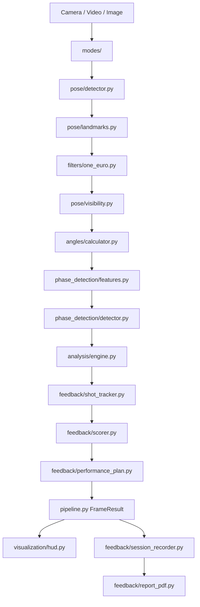

# Swichy Architecture

Layered design: **input → pipeline (analysis) → output (HUD + PDF)**. Each module has one job.

---

## System Diagram (Current)



---

## Module Responsibilities

### `pose/`
| File | Role |
|------|------|
| `detector.py` | MediaPipe Pose Landmarker (IMAGE / VIDEO / LIVE_STREAM) |
| `landmarks.py` | Image + world landmarks; basketball subset incl. **index finger** |
| `visibility.py` | `min(visibility, presence)` gating + temporal hold |

### `filters/`
| File | Role |
|------|------|
| `one_euro.py` | Adaptive smoothing per landmark axis |

### `geometry/` + `angles/`
| File | Role |
|------|------|
| `vectors.py` | 3D dot product angles, trunk vs vertical |
| `joint_chains.py` | elbow, knee, hip, shoulder, **index_align**, trunk |
| `calculator.py` | `AngleResult` with `is_valid`, `is_stable` |

### `phase_detection/`
| File | Role |
|------|------|
| `phases.py` | `PHASE_ORDER`, `TRANSITIONS`, labels |
| `features.py` | Velocities, index finger kinematics |
| `detector.py` | FSM: hysteresis (5) + min dwell (3) |

### `analysis/`
| File | Role |
|------|------|
| `engine.py` | YAML rule evaluation per phase |
| `models.py` | `RuleResult`, `AnalysisResult` |

### `feedback/`
| File | Role |
|------|------|
| `shot_tracker.py` | Shot boundaries; **mid-entry** when recording starts mid-rep |
| `scorer.py` | Weighted 0–100 per shot |
| `generator.py` | Coaching tip strings |
| `performance_plan.py` | Drills, action items, capture notes |
| `visibility_gaps.py` | Occlusion periods for PDF |
| `session_recorder.py` | Session-level shot + frame collection |
| `frame_capture.py` | Key frame selection |
| `report_builder.py` | `DetailedShotReport`, `SessionReport` |
| `report_pdf.py` | Primary PDF output |
| `report_writer.py` | Save PDF + optional markdown |
| `console.py` | Terminal shot summary |

### `visualization/`
| File | Role |
|------|------|
| `renderer.py` | Skeleton drawing |
| `hud.py` | Structured panels (phase, angles, violations) |
| `hud_display.py` | EMA + hold frames so on-screen text is readable |
| `report_frame.py` | Annotated frames for PDF |

### `modes/`
| File | Role |
|------|------|
| `live_stream.py` | Webcam + `SessionRecorder` |
| `video_mode.py` | File playback + recorder |
| `image_mode.py` | Single image report |

### `ball/` + `physics/` (stubs)
Empty implementations with TODOs — see [PHASE_6_BALL_AND_OUTCOME.md](PHASE_6_BALL_AND_OUTCOME.md).

### `config/`
| File | Role |
|------|------|
| `settings.py` | Paths, visibility thresholds, shooting hand |
| `phases.yaml` | FSM thresholds |
| `biomechanics.yaml` | 12 rules |
| `scoring.yaml` | Score weights |
| `display.yaml` | HUD smoothing, video playback speed |
| `report_config.yaml` | Key frames, auto-save |
| `filter_config.yaml` | One Euro parameters |
| `ball.yaml`, `hoop_roi.yaml`, `physics.yaml` | Phase 6 / #11 config |

---

## Design Principles

### Separation of concerns
`visualization/` never computes angles. `analysis/` never draws. `pipeline.py` is the single orchestrator.

### Phase-conditioned logic
Rules and scoring depend on **when** in the shot something happens, not just raw angles.

### Configuration over code
Thresholds and rules live in YAML so you can tune without rewriting Python.

---

## `FrameResult` (pipeline output)

```python
@dataclass
class FrameResult:
    image_landmarks, world_landmarks
    angles: Dict[str, AngleResult]
    features: KinematicFeatures
    analysis: AnalysisResult
    phase, phase_label, shooting_side
    shot_in_progress, shot_summary, capture_warning
    hud_display: HudDisplay          # smoothed for overlay
    timestamp_ms, has_pose
```

Any consumer (HUD, API, mobile) can use `FrameResult` without OpenCV.

---

## Learning Roadmap

| Week | Focus |
|------|-------|
| 1–2 | [PIPELINE.md](PIPELINE.md) + trace `process_frame()` |
| 3 | [ANGLES_3D.md](ANGLES_3D.md), [FILTERS.md](FILTERS.md), [VISIBILITY.md](VISIBILITY.md) |
| 4 | [PHASE_DETECTION.md](PHASE_DETECTION.md) — tune `phases.yaml` on side-view video |
| 5 | [BIOMECHANICS.md](BIOMECHANICS.md) + [BIOMECHANICS_RESEARCH.md](BIOMECHANICS_RESEARCH.md) |
| 6 | [FEEDBACK_SCORING.md](FEEDBACK_SCORING.md) + [REPORTING.md](REPORTING.md) |
| 7+ | [MANUAL_COMPLETION_GUIDE.md](MANUAL_COMPLETION_GUIDE.md) → implement Phase 6 |

---

## Related

- [MANUAL_COMPLETION_GUIDE.md](MANUAL_COMPLETION_GUIDE.md) — file map + completion checklist
- [FUTURE_IMPROVEMENTS.md](FUTURE_IMPROVEMENTS.md) — roadmap after Phase 6

The legacy `core/` package contains thin deprecation shims pointing to new modules.
