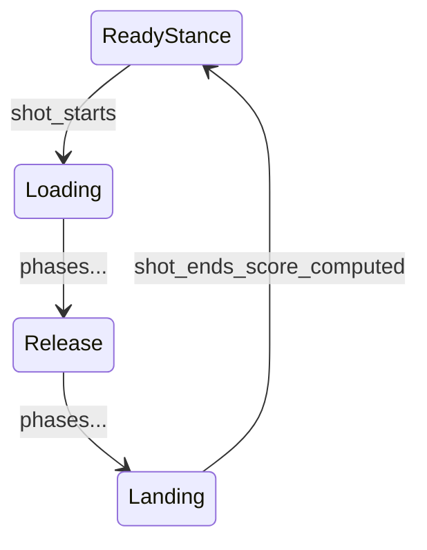

# Phase 5 — Scoring & Coaching Feedback

## What Changed

| File | Change |
|------|--------|
| [`feedback/shot_tracker.py`](../feedback/shot_tracker.py) | **New** — Detects shot start/end, collects frames per rep |
| [`feedback/scorer.py`](../feedback/scorer.py) | **New** — Weighted 0–100 shot score |
| [`feedback/generator.py`](../feedback/generator.py) | **New** — Prioritized coaching tips |
| [`feedback/models.py`](../feedback/models.py) | **New** — `ShotSummary` dataclass |
| [`feedback/console.py`](../feedback/console.py) | **New** — Terminal shot report |
| [`config/scoring.yaml`](../config/scoring.yaml) | **New** — Score weights and messages |
| [`pipeline.py`](../pipeline.py) | Integrated shot tracker after rules |
| [`visualization/renderer.py`](../visualization/renderer.py) | Shot summary panel overlay |
| [`modes/video_mode.py`](../modes/video_mode.py) | Prints shot report to console |

---

## Why It Changed

Phases 1–4 measure and judge **per frame**. Phase 5 answers: **"How good was that entire shot?"**

A coach does not score every millisecond — they evaluate the **whole rep** after landing and give 1–3 things to fix.

---

## How Shot Boundaries Work



| Event | Condition |
|-------|-----------|
| **Shot starts** | `ready_stance` → `loading` |
| **Shot ends** | `landing` → `ready_stance` |
| **Score computed** | All rule results from shot frames aggregated |

While `shot_in_progress` is true, every frame snapshot is stored for scoring.

---

## Scoring Algorithm

### Step 1 — Aggregate rules across the shot

For each `rule_id`, if it **failed on any frame** during the shot → counts as failed for the whole shot.

If it failed multiple times, keep the **highest severity** violation.

### Step 2 — Weighted score

```yaml
# config/scoring.yaml
severity_weights:
  error: 3
  warning: 2
  info: 1
```

```
score = 100 × (sum of weights for passed rules) / (sum of weights for all rules)
```

**Example:** 2 rules passed (warning + info = 3), 1 failed (warning = 2)  
→ score = 100 × 3/5 = **60**

### Step 3 — Grade

| Score | Grade |
|-------|-------|
| 90–100 | Excellent |
| 75–89 | Good |
| 60–74 | Fair |
| 0–59 | Needs Work |

### Step 4 — Coaching tips

1. Sort violations by severity (error → warning → info)
2. Take top 3 violation messages
3. Append overall encouragement based on score band

---

## ShotSummary

```python
@dataclass
class ShotSummary:
    shot_number: int
    score: int              # 0-100
    passed_count: int
    total_count: int
    passed_rules: list
    violations: list
    coaching_tips: list[str]
    phases_seen: list[str]
    grade: str              # property: Excellent/Good/Fair/Needs Work
```

---

## What You See

### On screen (after each shot, ~3 seconds)

Black summary panel:
```
SHOT #1  GOOD
Score: 78/100
Rules: 6/8 passed
Coach:
  Extend elbow fully at release
  Solid form. Refine the notes above.
```

### In terminal (video/live mode)

```
==================================================
  SHOT #1  —  GOOD  (78/100)
==================================================
  Rules: 6/8 passed

  Passed:
    + Knee Flexion (Load)
    + Trunk Posture

  Fix next:
    - Elbow Extension (Release): Extend elbow fully...

  Coach says:
    > Extend elbow fully at release for arc and power
    > Solid form. Refine the notes above.
==================================================
```

---

## Tuning `config/scoring.yaml`

| Setting | Effect |
|---------|--------|
| `severity_weights` | How much each severity level affects score |
| `max_coaching_tips` | Tips shown on overlay |
| `summary_display_frames` | How long summary panel stays (90 ≈ 3s at 30fps) |
| `score_messages` | Text for each grade band |

---

## AI Concepts to Study

### Concept: Temporal Aggregation

**What it is:** Combining per-frame measurements into one decision for an entire event.

**Why we use it:** A single bad frame during release should affect the shot score, but random noise in stance should not dominate.

**Alternatives:** Average all frame scores, use only peak frame, ML over full sequence.

**Difficulty:** Beginner–Intermediate

---

### Concept: Weighted Scoring

**What it is:** Different errors have different importance — elbow at release matters more than minor head movement.

**Why we use it:** Matches how human coaches prioritize feedback.

**Difficulty:** Beginner

---

## Pipeline Position

```
Biomechanical Rules (per frame)
        ↓
Shot Tracker (collect frames per rep)
        ↓
Scorer (aggregate → 0-100)  ← YOU ARE HERE
        ↓
Feedback Generator (tips)
        ↓
Display + Console
```

See also: [PHASES_OVERVIEW.md](PHASES_OVERVIEW.md)
