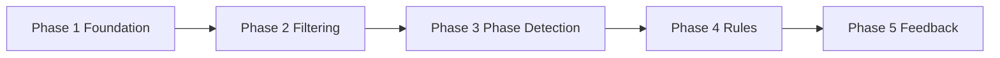

# Swichy Development Phases — Complete Guide (1 → 5)

This document explains **every development phase** of the AI Basketball Shooting Coach: what was built, why, how it works, and what to study. Read this first for the full picture.

---

## Roadmap at a Glance



| Phase | Name | Status | Core question answered |
|-------|------|--------|----------------------|
| **1** | Foundation | **Done** | How do we measure joints accurately in 3D? |
| **2** | Filtering & Visibility | **Done** | How do we make measurements stable and trustworthy? |
| **3** | Phase Detection | **Done** | *When* in the shot should we measure? |
| **4** | Biomechanical Rules | **Done** | *What* is good or bad form at each moment? |
| **5** | Scoring & Feedback | **Done** | How do we score a shot and coach the player? |
| **5b** | Session Reports | **Done** | How do we deliver a full form report with key frames? |
| **6** | Ball & Outcome | **Planned** | Did the player score? (ball tracking + timeseries) |

---

## End-to-End Pipeline (All Phases)

```
Camera
  ↓
[Phase 1] Pose Detection (MediaPipe)
  ↓
[Phase 1] World Landmark Extraction
  ↓
[Phase 2] One Euro Filter
  ↓
[Phase 2] Visibility Gating
  ↓
[Phase 1] 3D Angle Computation
  ↓
[Phase 3] Kinematic Features (velocity, heights)
  ↓
[Phase 3] Phase Detection FSM
  ↓
[Phase 4] Biomechanical Rule Engine
  ↓
[Phase 5 — planned] Shot Scoring + Coaching Text
[Phase 5b] Session Report + Key Frames
  ↓
Visualization (OpenCV overlay)
```

---

# Phase 1 — Foundation

## What was implemented

| Module | Files |
|--------|-------|
| 3D geometry | [`geometry/vectors.py`](../geometry/vectors.py) |
| Joint angles | [`angles/calculator.py`](../angles/calculator.py), [`angles/joint_chains.py`](../angles/joint_chains.py) |
| Pose wrapper | [`pose/detector.py`](../pose/detector.py), [`pose/landmarks.py`](../pose/landmarks.py) |
| Pipeline shell | [`pipeline.py`](../pipeline.py) |
| Modes | [`modes/live_stream.py`](../modes/live_stream.py), [`modes/video_mode.py`](../modes/video_mode.py), [`modes/image_mode.py`](../modes/image_mode.py) |

## Why

The original code used **2D image-plane angles** (`arctan2` on x,y). Camera angle changes distort these numbers. Phase 1 replaced that with **3D vector math on MediaPipe world landmarks** (meters, hip-centered body frame).

## Key implementation

```python
# angles/calculator.py — angle at vertex B between segments B→A and B→C
v1 = segment_vector(b, a)
v2 = segment_vector(b, c)
degrees = angle_between_vectors(v1, v2)  # dot product, rotation-invariant
```

World landmarks come from `detection_result.pose_world_landmarks[0]` in [`pose/landmarks.py`](../pose/landmarks.py).

## What you see

- Green skeleton on video
- Elbow, knee, trunk angles (3D)

## Learn more

- [ANGLES_3D.md](ANGLES_3D.md)
- [ARCHITECTURE.md](ARCHITECTURE.md)

---

# Phase 2 — Filtering & Visibility

## What was implemented

| Module | Files |
|--------|-------|
| One Euro Filter | [`filters/one_euro.py`](../filters/one_euro.py) |
| Visibility gating | [`pose/visibility.py`](../pose/visibility.py) |
| Config | [`config/filter_config.yaml`](../config/filter_config.yaml) |
| Timestamps | [`utils/timestamps.py`](../utils/timestamps.py) |

## Why

Raw landmarks **jitter** every frame. Noisy positions → noisy angles → false coaching. One Euro Filter smooths noise while staying responsive during fast release motion.

Visibility gating prevents computing angles when landmarks are **occluded** (returns `N/A` instead of wrong numbers).

## Key implementation

```python
# pipeline.py — order matters: filter BEFORE angles
world = self._filter_bank.filter_landmarks(raw["world"], timestamp_s)
world = self._visibility.apply(world)
angles = self._angle_calculator.compute_all(world, shooting_side)
```

## What you see

- Smoother angle numbers
- `N/A` or `~145` when landmarks are unreliable

## Learn more

- [FILTERS.md](FILTERS.md)
- [VISIBILITY.md](VISIBILITY.md)

---

# Phase 3 — Phase Detection

## What was implemented

| Module | Files |
|--------|-------|
| Phase FSM | [`phase_detection/detector.py`](../phase_detection/detector.py) |
| Kinematic features | [`phase_detection/features.py`](../phase_detection/features.py) |
| Phase definitions | [`phase_detection/phases.py`](../phase_detection/phases.py) |
| Config | [`config/phases.yaml`](../config/phases.yaml) |
| Frame buffer | [`utils/frame_buffer.py`](../utils/frame_buffer.py) |

## Why

A single frame cannot tell you if the player is **loading**, **releasing**, or **landing**. Rules must be **phase-aware**: elbow angle at release matters; at loading it does not.

## The 8 shot phases

| # | Phase ID | Human label | What happens |
|---|----------|-------------|--------------|
| 1 | `ready_stance` | Ready Stance | Standing still before the shot |
| 2 | `loading` | Loading | Dipping — hips/knees flex, ball low |
| 3 | `knee_flexion` | Knee Flexion | Bottom of the dip |
| 4 | `ball_lift` | Ball Lift | Raising ball toward set point |
| 5 | `jump` | Jump | Leaving the ground |
| 6 | `release` | Release | Ball leaves hand — wrist at apex |
| 7 | `follow_through` | Follow-Through | Arm extends after release |
| 8 | `landing` | Landing | Feet return to floor |

## Algorithm (FSM + hysteresis)

1. **Extract kinematic features** each frame: wrist/ankle/hip velocity, knee angle delta, total body speed.
2. **Evaluate transition conditions** for the current phase (thresholds in `phases.yaml`).
3. **Hysteresis**: require N consecutive frames (default 3) before switching phase — prevents flicker.
4. **Valid transitions only** — defined in [`phase_detection/phases.py`](../phase_detection/phases.py) `TRANSITIONS` dict.

Example transition:
```
ready_stance → loading
  WHEN: hip dropping OR knee flexing
  AND:  wrist below shoulder
```

## Key implementation

```python
# pipeline.py
features = extract_features(world, angles, shooting_side, prev_world, ...)
phase = self._phase_detector.update(features)
```

## What you see

- `Phase: Release` (or Loading, Jump, etc.) on screen
- Phase drives which rules fire in Phase 4

## Learn more

- [PHASE_DETECTION.md](PHASE_DETECTION.md)

---

# Phase 4 — Biomechanical Rules

## What was implemented

| Module | Files |
|--------|-------|
| Rule engine | [`analysis/engine.py`](../analysis/engine.py) |
| Data models | [`analysis/models.py`](../analysis/models.py) |
| Config | [`config/biomechanics.yaml`](../config/biomechanics.yaml) |

## Why

Angles alone are not coaching. Phase 4 adds **judgment**: compare measurements to acceptable **ranges** (not exact targets like "90°") and produce pass/fail feedback per rule.

## The 10 rules (configurable)

| Rule ID | Phase(s) | What it checks |
|---------|----------|----------------|
| `knee_flexion_loading` | loading, knee_flexion | Knee angle 70–130° |
| `hip_hinge_loading` | loading, knee_flexion | Hip angle 140–175° |
| `elbow_slot_ball_lift` | ball_lift | Elbow 70–120° (ball in slot) |
| `shoulder_alignment_lift` | ball_lift, jump | Shoulder angle 60–120° |
| `trunk_posture` | stance through release | Trunk lean 5–25° from vertical |
| `head_stability` | loading → release | Nose velocity < 0.08 m/s |
| `elbow_extension_release` | release | Elbow 155–180° |
| `release_height` | release | Wrist above nose (0.15–0.55 m) |
| `follow_through_elbow` | follow_through | Elbow 150–180° |
| `landing_balance` | landing | Ankle near baseline |

## Key implementation

```python
# analysis/engine.py
for rule_id, rule in self._rules.items():
    if phase not in rule.get("phases", []):
        continue  # only evaluate rules for current phase
    measured = self._measure(rule["metric"], angles, features, side)
    passed = min <= measured <= max
```

## What you see

- `Rules: 2/3 passed` on overlay
- Green `OK ...` or orange/red `! Adjust ...` coaching lines

## Learn more

- [BIOMECHANICS.md](BIOMECHANICS.md)

---

# Phase 5 — Scoring & Feedback

## What was implemented

| Module | Files |
|--------|-------|
| Shot tracker | [`feedback/shot_tracker.py`](../feedback/shot_tracker.py) |
| Scorer | [`feedback/scorer.py`](../feedback/scorer.py) |
| Tip generator | [`feedback/generator.py`](../feedback/generator.py) |
| Console output | [`feedback/console.py`](../feedback/console.py) |
| Config | [`config/scoring.yaml`](../config/scoring.yaml) |

## Why

Phase 4 evaluates rules **per frame**. Phase 5 aggregates an entire shot attempt into:
- One **score** (0–100)
- A **grade** (Excellent / Good / Fair / Needs Work)
- **Prioritized coaching tips** (top 3 fixes)

## How a shot is detected

```
Shot START:  ready_stance → loading
Shot END:    landing → ready_stance
```

All frames between start and end are collected. Rule results are aggregated — if a rule failed on **any** frame, it counts as failed for the shot.

## Scoring formula

```
score = 100 × (earned_weight / total_weight)

earned_weight = sum of severity weights for passed rules
total_weight  = sum of severity weights for all unique rules evaluated
```

Weights from `scoring.yaml`: error=3, warning=2, info=1

## Key implementation

```python
# pipeline.py
completed_shot = self._shot_tracker.update(phase, snapshot)
# completed_shot is ShotSummary when landing → ready_stance
```

## What you see

- **During shot:** `Shot: IN PROGRESS` on overlay
- **After shot:** Summary panel for ~3 seconds + console report
- **Between shots:** `Last Shot: 78/100`

## Learn more

- [FEEDBACK_SCORING.md](FEEDBACK_SCORING.md)

---

# Phase 5b — Session Reports (Done)

After video, live, or image analysis, Swichy writes a **detailed markdown report** with **annotated key frames** showing where form needs improvement.

## Output

```
outputs/reports/{session_id}/REPORT.md
outputs/reports/{session_id}/frames/shot_01_frame_*.jpg
```

## Key modules

- `feedback/session_recorder.py` — collects shots across a session
- `feedback/frame_capture.py` — picks phase + violation frames
- `feedback/report_builder.py` — builds shot and session reports
- `feedback/report_writer.py` — saves markdown + images

## Learn more

- [REPORTING.md](REPORTING.md)

---

# All Phases Complete

The full Swichy pipeline is now:

```
Pose → Filter → Angles → Phases → Rules → Score → Coach → Report
  P1      P2       P1       P3       P4      P5     P5      P5b
```

Future commercial features (session history, ball tracking, ML phases) are in [FUTURE_IMPROVEMENTS.md](FUTURE_IMPROVEMENTS.md).

---

# How to Tune the System

| Config file | Tunes |
|-------------|-------|
| [`config/filter_config.yaml`](../config/filter_config.yaml) | Smoothing vs responsiveness |
| [`config/phases.yaml`](../config/phases.yaml) | Phase transition sensitivity |
| [`config/biomechanics.yaml`](../config/biomechanics.yaml) | Acceptable form ranges |
| [`config/settings.py`](../config/settings.py) | Visibility, FPS, shooting hand, report output dir |
| [`config/scoring.yaml`](../config/scoring.yaml) | Shot score weights |
| [`config/report_config.yaml`](../config/report_config.yaml) | Key frames and auto-save |

---

# Learning Roadmap

| Week | Focus | Read |
|------|-------|------|
| 1 | 3D angles, world landmarks | ANGLES_3D.md |
| 2 | Filtering, visibility | FILTERS.md, VISIBILITY.md |
| 3 | Phase FSM, velocities | PHASE_DETECTION.md |
| 4 | Rule engine, YAML config | BIOMECHANICS.md |
| 5 | Run on your videos, tune thresholds | phases.yaml, biomechanics.yaml |
| 6 | Session reports, key frames | REPORTING.md |
| 7+ | Commercial features | FUTURE_IMPROVEMENTS.md |

---

# File Map by Phase

```
Phase 1:  pose/  geometry/  angles/  pipeline.py  modes/
Phase 2:  filters/  pose/visibility.py  config/filter_config.yaml
Phase 3:  phase_detection/  config/phases.yaml  utils/frame_buffer.py
Phase 4:  analysis/  config/biomechanics.yaml
Phase 5:  feedback/  config/scoring.yaml
Phase 5b: feedback/report_*.py  feedback/session_recorder.py  config/report_config.yaml
All:      visualization/renderer.py  docs/
```
