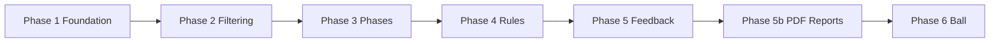

# Swichy Development Phases — Complete Guide (1 → 6)

Full picture of what is built, how it connects, and what you implement next.

**To study and finish manually:** [MANUAL_COMPLETION_GUIDE.md](MANUAL_COMPLETION_GUIDE.md)

---

## Roadmap at a Glance



| Phase | Name | Status | Core question |
|-------|------|--------|---------------|
| **1** | Foundation | **Done** | How do we measure joints in 3D? |
| **2** | Filtering & Visibility | **Done** | How do we make measurements stable? |
| **3** | Phase Detection | **Done** | *When* in the shot do we measure? |
| **4** | Biomechanical Rules | **Done** | *What* is good/bad form at each moment? |
| **5** | Scoring & Feedback | **Done** | How do we score a rep and coach? |
| **5b** | PDF Performance Reports | **Done** | How do we deliver actionable training plans? |
| **6a** | Ball & Rim Detection | **Integrated** | Where are the ball and hoop? |
| **6b–6d** | Release, Outcome & Trajectory | **In progress** | Did the player score? |

---

## End-to-End Pipeline

```
Camera
  ↓ Pose (MediaPipe)
  ↓ One Euro Filter
  ↓ Visibility + Presence Gating
  ↓ 3D Angles (+ index_align)
  ↓ Kinematic Features
  ↓ Phase FSM (hysteresis + dwell)
  ↓ Biomechanical Rules (12 rules)
  ↓ Shot Tracker (incl. mid-entry)
  ↓ Score + Performance Plan
  ↓ HUD (smoothed) + PDF Report
```

---

# Phase 1 — Foundation ✅

| Module | Files |
|--------|-------|
| 3D geometry | `geometry/vectors.py` |
| Joint angles | `angles/calculator.py`, `angles/joint_chains.py` |
| Pose | `pose/detector.py`, `pose/landmarks.py` |
| Pipeline | `pipeline.py`, `modes/` |

**Why:** 2D image angles change with camera rotation. World landmarks + 3D dot product are rotation-invariant.

**Learn:** [ANGLES_3D.md](ANGLES_3D.md)

---

# Phase 2 — Filtering & Visibility ✅

| Module | Files |
|--------|-------|
| One Euro | `filters/one_euro.py` |
| Visibility | `pose/visibility.py` |
| Config | `config/filter_config.yaml` |

**Why:** Raw landmarks jitter; occluded joints produce false angles. Filter first, then gate with `min(visibility, presence)`.

**Learn:** [FILTERS.md](FILTERS.md), [VISIBILITY.md](VISIBILITY.md)

---

# Phase 3 — Phase Detection ✅

| Module | Files |
|--------|-------|
| FSM | `phase_detection/detector.py` |
| Features | `phase_detection/features.py` (+ index finger) |
| Config | `config/phases.yaml` |

**8 phases:** ready_stance → loading → knee_flexion → ball_lift → jump → release → follow_through → landing

**Stability:** `hysteresis_frames: 5`, `min_dwell_frames: 3`

**Index finger:** `index_align_angle`, `index_velocity_y` for release/follow-through

**Learn:** [PHASE_DETECTION.md](PHASE_DETECTION.md)

---

# Phase 4 — Biomechanical Rules ✅

| Module | Files |
|--------|-------|
| Engine | `analysis/engine.py` |
| Rules | `config/biomechanics.yaml` (12 rules) |
| Research | `docs/BIOMECHANICS_RESEARCH.md` |

**Why:** Phase-gated ranges, not single target angles. Rules only fire in relevant phases.

**Learn:** [BIOMECHANICS.md](BIOMECHANICS.md)

---

# Phase 5 — Scoring & Feedback ✅

| Module | Files |
|--------|-------|
| Shot tracker | `feedback/shot_tracker.py` |
| Scorer | `feedback/scorer.py` |
| Tips | `feedback/generator.py` |
| Performance plan | `feedback/performance_plan.py` |
| Config | `config/scoring.yaml` |

**Shot boundaries:**
- Normal: `ready_stance → loading/ball_lift` … `landing → ready_stance`
- **Mid-entry:** recording starts mid-rep → still tracked, flagged in report
- **Early end:** video stops mid-shot → `finalize_in_progress()`, `ended_early=True`

**Learn:** [FEEDBACK_SCORING.md](FEEDBACK_SCORING.md)

---

# Phase 5b — PDF Performance Reports ✅

| Module | Files |
|--------|-------|
| Recorder | `feedback/session_recorder.py` |
| Key frames | `feedback/frame_capture.py` |
| Visibility gaps | `feedback/visibility_gaps.py` |
| PDF | `feedback/report_pdf.py` |
| Config | `config/report_config.yaml`, `config/display.yaml` |

**Output:** `outputs/reports/{session_id}/REPORT.pdf`

**Includes:** practice plan, drills, next-rep focus, capture status, key-frame images

**Learn:** [REPORTING.md](REPORTING.md)

---

# Phase 6 — Ball & Outcome 🚧

| Module | Status |
|--------|--------|
| `ball/yolo_model.py` | Integrated — custom model loading + GPU selection |
| `ball/detector.py` | Integrated — ball + rim |
| `ball/tracker.py` | Integrated — smoothing and short-gap interpolation |
| `ball/timeseries.py` | Integrated into the frame pipeline |
| `ball/release_sync.py` | Experimental — not production-fused |
| `ball/outcome.py` | Experimental — requires real-world validation |
| `ball/fusion.py` | Incomplete — not attached to production reports |
| `physics/trajectory.py` | Experimental (#11) |

**Setup:** [GPU_YOLO_SETUP.md](GPU_YOLO_SETUP.md)

**Design:** [PHASE_6_BALL_AND_OUTCOME.md](PHASE_6_BALL_AND_OUTCOME.md)

**Next:** fine-tune `yolo26n.pt` on phone footage, validate release/outcome,
then attach `ShotOutcome` to reports.

---

# Configuration Reference

| File | Tunes |
|------|-------|
| `config/filter_config.yaml` | Smoothing |
| `config/phases.yaml` | FSM thresholds, hysteresis, dwell |
| `config/biomechanics.yaml` | Rule ranges and messages |
| `config/scoring.yaml` | Score weights |
| `config/display.yaml` | HUD hold frames, video speed |
| `config/report_config.yaml` | Key frames, auto-save PDF |
| `config/settings.py` | Visibility, shooting hand, paths |

---

# File Map by Phase

```
Phase 1:  pose/  geometry/  angles/  pipeline.py  modes/
Phase 2:  filters/  pose/visibility.py  config/filter_config.yaml
Phase 3:  phase_detection/  config/phases.yaml
Phase 4:  analysis/  config/biomechanics.yaml  docs/BIOMECHANICS_RESEARCH.md
Phase 5:  feedback/shot_tracker.py  scorer.py  generator.py  performance_plan.py
Phase 5b: feedback/report_*.py  session_recorder.py  visibility_gaps.py
Phase 6:  ball/  physics/  config/ball.yaml  config/hoop_roi.yaml
All:      visualization/  tests/  assets/  docs/
```

---

# Learning Roadmap

| Week | Focus | Read |
|------|-------|------|
| 1 | Pipeline + 3D angles | PIPELINE.md, ANGLES_3D.md |
| 2 | Filter + visibility | FILTERS.md, VISIBILITY.md |
| 3 | Phase FSM | PHASE_DETECTION.md, tune phases.yaml |
| 4 | Rules + research | BIOMECHANICS.md, BIOMECHANICS_RESEARCH.md |
| 5 | Scoring + PDF reports | FEEDBACK_SCORING.md, REPORTING.md |
| 6 | Ball/rim + CUDA | GPU_YOLO_SETUP.md, PHASE_6_BALL_AND_OUTCOME.md |
| 7–8 | Release/outcome validation | MANUAL_COMPLETION_GUIDE.md, PRODUCT_ROADMAP.md |

---

# Tests

```powershell
python tests/test_angles.py
python tests/test_phases.py
python tests/test_feedback.py
python tests/test_performance_plan.py
python tests/test_visibility_gaps.py
python tests/test_hud_display.py
python tests/test_reporting.py
```
