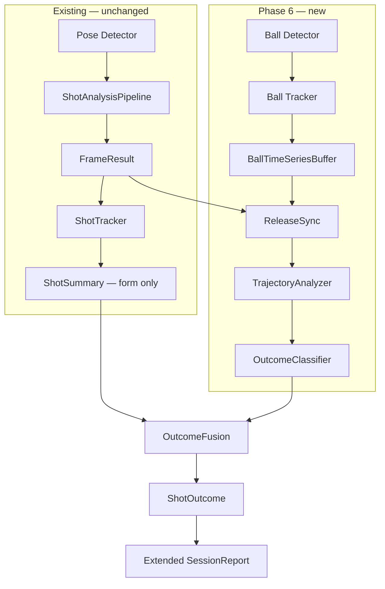
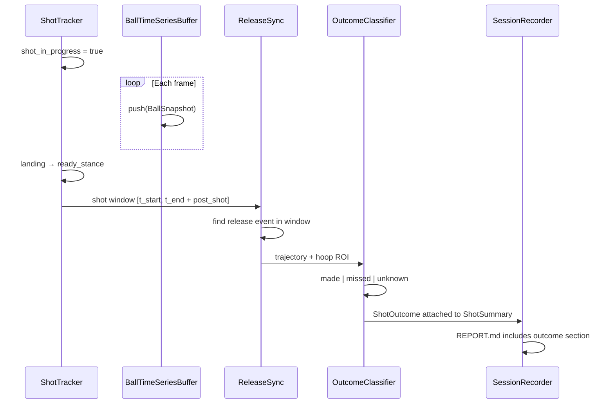

# Phase 6 — Ball Tracking & Shot Outcome (Future Plan)

> **Status:** Planned — not implemented  
> **Depends on:** Phases 1–5b (pose, phases, rules, form scoring, session reports)  
> **Goal:** Detect the ball, track it through release and flight, and answer: *Did the player score?* — using **time-series** signals, not just a single frame.

---

## Why This Phase Exists

Swichy today answers **how** the player shot:

| Question | Current system | Phase 6 |
|----------|----------------|---------|
| Is form good? | Biomechanical rules + 0–100 form score | Same |
| When did release happen? | Phase FSM (`release` phase) | Refined with ball–wrist sync |
| Did the ball go in? | **Not measured** | **Make / miss / unknown** |
| Was form linked to outcome? | **Not measured** | Correlate form score vs result |

The ball is never detected in the current pipeline. Modes (`live`, `video`, `image`) only run **body pose** analysis. A complete coaching product needs both:

1. **Form quality** — already built (Phases 4–5b)
2. **Performance outcome** — whether the attempt scored

This document is the implementation blueprint for step 2.

---

## Current Flow vs Proposed Flow

### Today (Phases 1–5b)

```
Camera → Pose → Filter → Angles → Phases → Rules → Form Score → Report
```

Shot boundaries are inferred from **body phases** only:

- Shot **starts:** `ready_stance → loading`
- Shot **ends:** `landing → ready_stance`

There is no object in the scene besides the player skeleton.

### Proposed (Phase 6)

```
Camera → Pose branch (existing)
      → Ball branch (new)
              ↓
      Time-series fusion
              ↓
      Outcome engine (make / miss / unknown)
              ↓
      Extended ShotSummary + SessionReport
```

The pose branch stays unchanged. A parallel **ball branch** adds detection, tracking, and trajectory time-series. A fusion layer links ball events to the existing shot window.

---

## What Phase 6 Must Deliver

### Functional requirements

1. **Ball detection** — locate the ball in image space each frame (or at high-confidence frames)
2. **Ball tracking** — maintain ball identity across frames after release
3. **Release sync** — align ball leaving the hand with body `release` phase (±N frames)
4. **Outcome classification** — `made` | `missed` | `unknown` per shot attempt
5. **Timeseries evidence** — store the signal trail that led to the decision (for reports and debugging)
6. **Mode parity** — same outcome logic for `video` and `live`; `image` mode remains form-only (no flight)

### Non-goals (v1)

- Exact 3D ball position without calibration
- Net physics simulation
- Multi-ball drills (one ball per shot window)
- Automatic hoop detection in arbitrary gym angles (v1 may require fixed camera or manual hoop ROI)

---

## High-Level Architecture



### Proposed new modules (future)

| Module | Responsibility |
|--------|----------------|
| `ball/detector.py` | Per-frame ball bounding box or center |
| `ball/tracker.py` | Multi-frame ball ID + Kalman / ByteTrack-style smoothing |
| `ball/timeseries.py` | Ring buffer of `BallSnapshot` (position, velocity, confidence) |
| `ball/release_sync.py` | Match ball departure to wrist landmarks + `release` phase |
| `ball/trajectory.py` | Fit parabolic arc; estimate apex, entry angle proxy |
| `ball/outcome.py` | Make/miss logic from timeseries + optional hoop ROI |
| `ball/models.py` | `BallSnapshot`, `BallTrajectory`, `ShotOutcome` dataclasses |
| `config/ball.yaml` | Detector thresholds, hoop ROI, outcome rules |
| `config/hoop_roi.yaml` | Optional manual hoop region per camera setup |

### Extensions to existing types

```python
# Future — not implemented

@dataclass
class BallSnapshot:
    timestamp_ms: int
    frame_index: int
    center_xy: tuple[float, float]      # image pixels
    confidence: float
    velocity_xy: tuple[float, float]    # px/s from timeseries derivative
    state: str                         # in_hand | in_flight | at_rim | unknown

@dataclass
class ShotOutcome:
    result: str                        # made | missed | unknown
    confidence: float                  # 0–1
    release_frame: int | None
    release_timestamp_ms: int | None
    entry_frame: int | None            # ball crosses hoop plane proxy
    trajectory_apex_frame: int | None
    evidence: list[str]                # human-readable reasons
    timeseries_summary: dict           # compact stats for report

@dataclass
class ShotSummary:  # extended
    # ... existing form fields ...
    outcome: ShotOutcome | None = None
```

`FrameResult` may later gain optional `ball: BallSnapshot | None` without breaking current consumers.

---

## Time-Series: The Core of Outcome Detection

Outcome cannot be decided from one frame. Phase 6 treats the shot as a **sequence** of observations.

### Signal streams to record

| Stream | Source | Use |
|--------|--------|-----|
| Wrist Y (world) | Existing `KinematicFeatures` | Release timing candidate |
| Elbow extension rate | Existing angles derivative | Confirm release |
| Ball center (x, y) | Ball detector | Flight path |
| Ball velocity | `d(position)/dt` | Detect launch and rim crossing |
| Ball–wrist distance | Fused | `in_hand` vs `in_flight` transition |
| Hoop ROI occupancy | Ball position vs configured region | Make/miss at rim |

### Timeseries buffer design

Mirror the existing `FrameBuffer` pattern in [`utils/frame_buffer.py`](../utils/frame_buffer.py):

```
BallTimeSeriesBuffer
  - push(BallSnapshot) each frame
  - get_window(start_ms, end_ms) → list[BallSnapshot]
  - compute_velocity() → smoothed vx, vy (One Euro or Savitzky–Golay)
  - detect_events() → release, apex, rim_crossing
```

**Window alignment:** When `ShotTracker` closes a shot at `landing → ready_stance`, extend the analysis window by `post_shot_ms` (e.g. 1500 ms) to capture ball flight after the body lands.

### Event detection (rule-based v1)

| Event | Timeseries rule |
|-------|-----------------|
| **Release** | Ball–wrist distance exceeds threshold AND wrist velocity peak AND phase ≥ `release` |
| **In flight** | Ball confidence > τ for ≥ 3 consecutive frames after release |
| **Apex** | Ball Y velocity crosses zero (up → down) |
| **Rim approach** | Ball enters hoop ROI from above |
| **Made** | Ball center inside rim inner ellipse + downward velocity at crossing + no immediate exit |
| **Missed** | Ball crosses hoop plane but outside rim OR hits rim zone with high lateral velocity |
| **Unknown** | Low ball confidence, occlusion, or no hoop ROI configured |

Hysteresis and minimum-duration filters (same idea as phase FSM) prevent flicker.

---

## Ball Detection Options (Research → Production)

### Option A — Color + shape (fastest prototype)

- HSV orange segmentation + circularity filter
- **Pros:** No ML model, fast on CPU  
- **Cons:** Fails under mixed lighting, non-orange balls, motion blur

### Option B — Dedicated object detector (recommended v1)

- Fine-tuned YOLO / RT-DETR on basketball datasets  
- Classes: `ball`, optionally `rim`, `backboard`  
- **Pros:** Robust across backgrounds  
- **Cons:** Needs labeled data, GPU helps at high FPS

### Option C — MediaPipe / holistic + custom head

- Not available out of the box for ball; would still need custom detector

### Option D — Multi-camera triangulation

- See [FUTURE_IMPROVEMENTS.md](FUTURE_IMPROVEMENTS.md) #1 — late stage, highest accuracy

**Suggested path:** B for detection, rule-based timeseries for outcome in v1; optional ML outcome classifier in v2.

---

## Hoop / Rim Context

Make/miss requires a **goal reference**. Three tiers:

| Tier | Setup | Accuracy |
|------|-------|----------|
| **1. Manual ROI** | User draws hoop rectangle once per camera | Good for fixed backyard/hoop cam |
| **2. Rim detector** | YOLO class `rim` + auto ROI | Better for portable setups |
| **3. Calibrated court** | Homography to court plane | Best for gym / multi-angle |

v1 should support **Tier 1** (config file) so development is unblocked without full court vision.

Example future config:

```yaml
# config/hoop_roi.yaml (illustrative)
hoop:
  enabled: true
  roi_normalized: [0.42, 0.05, 0.58, 0.22]  # x1,y1,x2,y2 in 0–1
  rim_inner_scale: 0.72                       # shrink ROI for "made" zone
post_shot_capture_ms: 2000
```

---

## Fusion With Existing Shot Lifecycle



### Form score vs outcome score (conceptual)

Keep these **separate** so coaching stays honest:

| Metric | Meaning |
|--------|---------|
| **Form score** (existing) | Biomechanics quality 0–100 |
| **Outcome** (new) | Made or missed |
| **Performance index** (optional future) | Weighted combo for gamification |

A player can have **good form + miss** (rim variance) or **bad form + make** (lucky). Reports should show both.

---

## Report Extensions (Future)

Add to [`REPORT.md`](REPORTING.md) output:

```markdown
### Shot #1 — Form: 78/100 (Good) — Result: MADE ✓

- Release synced at 00:02.04 (frame 61)
- Ball apex at 00:02.31
- Entry angle (proxy): 52°
- Form–outcome note: Clean release; miss on previous shot was trajectory not elbow.
```

New key frame types:

- Release frame (ball leaving hand)
- Apex frame (highest ball position)
- Rim crossing frame (make or miss evidence)

---

## Implementation Phases (Suggested Order)

### 6a — Ball detection prototype

- [ ] `ball/detector.py` with YOLO or color fallback  
- [ ] Overlay ball bbox in `visualization/renderer.py` (debug mode)  
- [ ] `BallTimeSeriesBuffer` with velocity computation  
- [ ] No outcome yet — validate detection stability on `assets/videos/*.mp4`

### 6b — Release synchronization

- [ ] `ball/release_sync.py` — fuse wrist distance + phase + ball velocity  
- [ ] Metrics: % shots where release frame aligns within ±2 frames of body release  
- [ ] Store `release_frame` on shot window

### 6c — Hoop ROI + rule-based outcome

- [ ] `config/hoop_roi.yaml` + UI or script to set ROI  
- [ ] `ball/outcome.py` — made / missed / unknown  
- [ ] Extend `ShotSummary` and session report  
- [ ] Unit tests with synthetic trajectories (parabolic curves through ROI)

### 6d — Trajectory analysis

- [ ] Parabolic fit, apex, entry angle proxy  
- [ ] Correlate entry angle with make/miss over a session (timeseries analytics)  
- [ ] Optional: link to [FUTURE_IMPROVEMENTS.md](FUTURE_IMPROVEMENTS.md) #11 physics model

### 6e — ML outcome classifier (optional v2)

- [ ] Train on labeled make/miss clips (trajectory features → label)  
- [ ] Fallback to rule-based when confidence low

---

## Testing Strategy (When Implemented)

| Test type | What it validates |
|-----------|-------------------|
| **Synthetic timeseries** | Parabolic `(x,y)` series → correct made/miss at rim |
| **Recorded clips** | Manually labeled `assets/` videos |
| **Sync test** | Release event within N frames of phase `release` |
| **Edge cases** | Occluded ball, air ball, rim bounce, no hoop in frame |

No implementation in this phase — tests are listed for future work.

---

## Risks & Mitigations

| Risk | Impact | Mitigation |
|------|--------|------------|
| Motion blur hides ball | Unknown outcome | Interpolate between high-confidence frames; widen `unknown` band |
| Fixed camera not showing hoop | Cannot score outcome | Require hoop in frame or disable outcome for that session |
| Orange clutter (shirts, signs) | False ball detections | Temporal consistency filter; size prior; ML detector |
| Monocular depth | Weak 3D arc | Use image-plane trajectory + ROI; defer 3D to multi-cam |
| Latency (two models) | Drops FPS | Run ball detector every 2nd frame; Kalman predict between |

---

## Dependencies & Prerequisites

Before starting Phase 6:

- [x] Stable shot window from `ShotTracker`  
- [x] `FrameBuffer` / per-shot frame history  
- [x] Session reports (`SessionRecorder`)  
- [ ] Labeled ball positions on sample videos (even 50 frames manual)  
- [ ] Hoop visible in at least one test video  
- [ ] Decision on detector (YOLO vs color)

**Python packages (future):** likely `ultralytics` or ONNX runtime for ball YOLO; existing OpenCV + NumPy sufficient for timeseries math.

---

## Related Documents

| Doc | Relation |
|-----|----------|
| [PIPELINE.md](PIPELINE.md) | Where ball branch attaches after pose |
| [PHASE_DETECTION.md](PHASE_DETECTION.md) | Release phase used for sync |
| [REPORTING.md](REPORTING.md) | Reports extended with outcome section |
| [FUTURE_IMPROVEMENTS.md](FUTURE_IMPROVEMENTS.md) | #6 Ball-body sync, #11 trajectory physics |
| [PHASES_OVERVIEW.md](PHASES_OVERVIEW.md) | Roadmap slot for Phase 6 |

---

## Summary

Phase 6 closes the loop between **shooting form** and **shooting results**. The current Swichy pipeline is body-only; the next step adds a parallel ball pipeline and uses **time-series fusion** (position, velocity, release sync, hoop ROI events) to determine whether each attempt scored. Implementation is deliberately deferred; this document defines the architecture, data models, and rollout order for when development starts.
