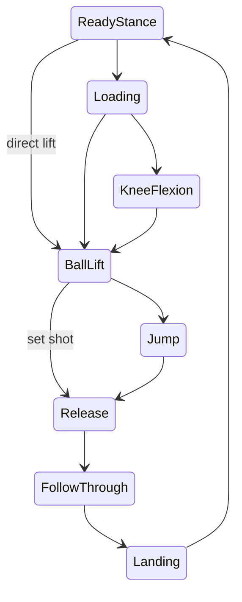

# Phase Detection

Phase detection answers one question for every frame:

> Where is the player in the shooting motion right now?

Swichy uses a deterministic finite state machine (FSM), not a learned phase
classifier. Pose landmarks are converted into motion features, transition rules
propose the next phase, and temporal confirmation prevents flicker.

## Read this after

1. [PIPELINE.md](PIPELINE.md)
2. [ANGLES_3D.md](ANGLES_3D.md)
3. [FILTERS.md](FILTERS.md)
4. [VISIBILITY.md](VISIBILITY.md)

Those documents explain the data that arrives at phase detection.

## Code map

| File | Responsibility |
|------|----------------|
| `phase_detection/features.py` | Convert reliable landmarks/angles into motion signals |
| `phase_detection/phases.py` | Define phase order, labels, and allowed transitions |
| `phase_detection/detector.py` | Evaluate transitions and apply temporal confirmation |
| `config/phases.yaml` | Store tunable thresholds |
| `pipeline.py` | Supply previous-frame data and call the detector |
| `tests/test_phases.py` | Validate expected phase behavior |

## End-to-end data flow

```text
MediaPipe world landmarks
        ↓
One Euro smoothing
        ↓
visibility/presence reliability gate
        ↓
3D angle calculator
        ↓
extract_features(current, previous, dt)
        ↓
KinematicFeatures
        ↓
ShotPhaseDetector._evaluate_transition()
        ↓
candidate next phase (or None)
        ↓
hysteresis + minimum dwell + allowed-transition check
        ↓
confirmed phase
```

The FSM never reads raw images or YOLO output. Ball/rim detection runs in a
parallel branch. A later release-synchronization stage can compare the body
release phase with the tracked ball.

## The eight phases

| # | ID | Physical meaning | Main signals |
|---|----|------------------|--------------|
| 1 | `ready_stance` | Player is still before or after a shot | low total body velocity |
| 2 | `loading` | Hips/knees dip or shooting wrist begins rising | hip velocity, knee delta, wrist position/velocity |
| 3 | `knee_flexion` | Player reaches the bottom and begins extending | knee angle reverses |
| 4 | `ball_lift` | Ball-hand rises toward the set point | wrist velocity and height |
| 5 | `jump` | Feet rise from the standing baseline | ankle displacement/velocity |
| 6 | `release` | Arm/finger reaches the release event | wrist peak, elbow extension, index alignment |
| 7 | `follow_through` | Shooting arm stays extended after release | wrist direction, elbow/index extension |
| 8 | `landing` | Ankles return near their baseline | ankle position and velocity |

## Valid state paths



Two intentional shortcuts exist:

- `ready_stance → ball_lift` handles a direct lift without a clear dip.
- `ball_lift → release` handles a set shot without a detected jump.

`TRANSITIONS` in `phase_detection/phases.py` is the source of truth. Transition
conditions in `detector.py` cannot jump to an unlisted state.

## Kinematic features

`KinematicFeatures` is a small, testable boundary between pose math and the FSM.

| Feature | Unit | Meaning |
|---------|------|---------|
| `wrist_y` | world metres | shooting wrist height |
| `wrist_velocity_y` | metres/second | wrist vertical speed |
| `index_y` | world metres | shooting index height |
| `index_velocity_y` | metres/second | index vertical speed |
| `index_align_angle` | degrees | elbow → wrist → index alignment |
| `ankle_y_avg` | world metres | average ankle height |
| `ankle_velocity_y` | metres/second | average ankle vertical speed |
| `ankle_baseline_y` | world metres | estimated standing ankle height |
| `knee_angle` | degrees | shooting-side knee angle |
| `knee_angle_delta` | degrees/frame | change since the previous frame |
| `hip_y_avg` / `hip_velocity_y` | metres, metres/second | loading dip |
| `elbow_angle` | degrees | arm extension |
| `total_velocity` | metres/second (average) | whole-body motion proxy |

Index velocity is zero and index alignment is invalid when the tip is not
reliable; wrist motion is never substituted for the finger signal.

`ankle_flexion` is available in `FrameResult.angles`, but the FSM deliberately
continues to use ankle height/velocity. This avoids changing phase behavior
until side-view shoe-tip measurements are validated. See
[LANDMARKS.md](LANDMARKS.md).

The project threshold convention treats positive world-Y velocity as upward and
negative as downward. Image pixel Y uses a different convention (downward is
positive); do not reuse these thresholds for image coordinates.

Only reliable landmarks contribute. If visibility gating marks a landmark
unreliable, its feature uses a safe default or the corresponding angle becomes
invalid.

## How one transition is confirmed

Assume the current phase is `ball_lift`:

1. `_evaluate_transition()` checks ankle rise/velocity.
2. If the jump condition is true, it proposes `jump`.
3. The same proposal must occur for `hysteresis_frames` consecutive updates.
4. The current phase must have lasted at least `min_dwell_frames`.
5. `ball_lift → jump` must exist in `TRANSITIONS`.
6. Only then does `self.phase` change to `jump`.

If a different candidate appears, its counter starts at one. If the candidate
equals the current phase, pending confirmation is cleared. If no candidate
appears, the detector holds its current phase.

Defaults from `config/phases.yaml`:

| Setting | Default | At 30 FPS | Purpose |
|---------|---------|-----------|---------|
| `hysteresis_frames` | 5 | about 167 ms | reject one-frame spikes |
| `min_dwell_frames` | 3 | about 100 ms | stop phases being skipped too quickly |

These settings are frame based. If production input FPS changes significantly,
validate them again.

## Transition rules

### Ready stance → loading / ball lift

Loading starts when the body dips (hip downward or knee flexing) while the wrist
is in a plausible carry region. Wrist lift can also start the motion.

### Loading → knee flexion / ball lift

Knee flexion is recognized when the knee-angle delta changes toward extension.
If the wrist is already rising, the FSM can move directly to ball lift.

### Ball lift → jump / release

Ankle movement above the learned standing baseline indicates a jump. A set shot
can move directly to release using wrist direction, elbow extension, or index
alignment.

### Jump → release

The detector combines multiple cues:

- wrist near its tracked peak and slowing,
- extended elbow while the wrist drives through,
- index-finger snap with an extended elbow,
- extended elbow-wrist-index chain.

Using alternatives makes release more robust when one landmark is briefly
unreliable.

### Release → follow-through

Follow-through is proposed when the wrist changes direction, the elbow remains
extended, or the index is extended and moving down.

### Follow-through → landing → ready stance

Landing requires ankles near the standing baseline with low vertical speed.
Ready stance returns when average body velocity falls below the configured
stillness threshold.

## Ankle baseline

`pipeline.py` maintains `ankle_baseline_y` while the player is relatively still:

```text
new baseline = 0.9 × old baseline + 0.1 × current ankle height
```

The baseline freezes during faster motion. Jump detection then uses ankle
displacement relative to that baseline instead of an absolute camera-dependent
height.

## Configuration and tuning

Tune [`config/phases.yaml`](../config/phases.yaml), not Python constants.

Recommended process:

1. Choose one representative clip and camera angle.
2. Record expected phase boundaries by frame.
3. Run the existing detector without changing multiple values.
4. Change one threshold.
5. Compare early/late transitions.
6. Repeat across front, side, and behind-hoop clips.
7. Keep a regression clip for every fixed failure.

Common symptoms:

| Symptom | First checks |
|---------|--------------|
| Phase flickers | increase `hysteresis_frames`; inspect landmark reliability |
| All transitions are late | reduce hysteresis slightly; check FPS/timestamps |
| Loading never starts | inspect hip/knee signs and wrist carry thresholds |
| Jump is skipped | inspect ankle baseline and ankle visibility |
| Set shot is stuck at ball lift | inspect elbow/index angles and wrist direction |
| Release occurs too early | tighten release elbow/index thresholds |
| Landing never occurs | inspect ankle baseline drift and landing tolerances |

Avoid tuning against one clip until it looks perfect. That usually overfits one
camera and player.

## Debugging checklist

For a bad transition, inspect these values for several frames before and after
the event:

1. current phase,
2. candidate phase,
3. pending count,
4. frames in current phase,
5. relevant feature values,
6. corresponding YAML thresholds,
7. reliability of the source landmarks,
8. frame timestamp and FPS.

The candidate/pending fields are currently internal. If deeper diagnostics are
needed, add an optional debug record rather than printing every frame in
production.

## Tests

```powershell
.\venv\Scripts\Activate.ps1
python tests/test_phases.py
```

Then run a full video:

```powershell
python main.py
```

Suggested manual phase clip:
`assets/videos/video_07_side_jump_shot.mp4`.

## What phase detection does not do

- It does not decide whether the shot was made.
- It does not detect the basketball or rim.
- It does not score form directly.
- It does not learn thresholds automatically.

The confirmed phase is consumed by:

- [BIOMECHANICS.md](BIOMECHANICS.md) for phase-specific form rules,
- [FEEDBACK_SCORING.md](FEEDBACK_SCORING.md) for shot boundaries,
- ball release synchronization in Phase 6.
