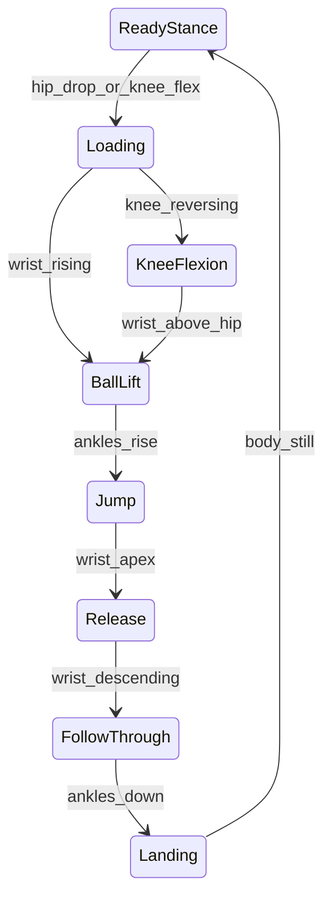

# Phase Detection

## What Changed

| File | Change |
|------|--------|
| [`phase_detection/detector.py`](../phase_detection/detector.py) | **New** — `ShotPhaseDetector` FSM |
| [`phase_detection/features.py`](../phase_detection/features.py) | **New** — `KinematicFeatures`, velocity extraction |
| [`phase_detection/phases.py`](../phase_detection/phases.py) | **New** — Phase order and valid transitions |
| [`config/phases.yaml`](../config/phases.yaml) | **New** — Configurable thresholds |
| [`pipeline.py`](../pipeline.py) | Integrated phase detection after angle computation |
| [`utils/frame_buffer.py`](../utils/frame_buffer.py) | Stores phase + features per frame |
| [`visualization/renderer.py`](../visualization/renderer.py) | Displays human-readable phase label |

---

## Why It Changed

Per-frame angles cannot answer *"Is this the release?"* A jump shot is a **sequence**. Phase detection segments that sequence so biomechanical rules (Phase 4) only fire at meaningful moments.

Without phases, you would penalize a bent elbow during loading — that is correct form at that moment.

---

## The 8 Phases Explained

### 1. Ready Stance
Player is still. Low total landmark velocity. Waiting to shoot.

**Signals:** `total_velocity < ready_max_velocity`

### 2. Loading
Athletic dip — hips drop, knees bend, ball stays below shoulder.

**Signals:** `hip_velocity_y < 0`, knee flexing, wrist below shoulder

### 3. Knee Flexion
Bottom of the dip — knees reversing from flexion to extension.

**Signals:** `knee_angle_delta > 0` (angle increasing = leg extending)

### 4. Ball Lift
Ball rises toward set point. Wrist moving upward.

**Signals:** `wrist_velocity_y > ball_lift_wrist_velocity`

### 5. Jump
Feet leave the ground. Ankles rise above standing baseline.

**Signals:** `ankle_y - ankle_baseline > jump_ankle_rise`

### 6. Release
Ball leaves the hand. Wrist at or near peak height, elbow extending.

**Signals:** wrist near tracked peak, elbow > 155°, wrist slowing

### 7. Follow-Through
Arm continues up and forward after release. Wrist moves down, elbow stays extended.

**Signals:** `wrist_velocity_y < 0`, elbow extended

### 8. Landing
Feet return to floor. Ankles near baseline, body slowing.

**Signals:** ankle near baseline → then `ready_stance` when still

---

## FSM Diagram



---

## Hysteresis

Without hysteresis, a single noisy frame could flip `loading` → `jump` → `loading`. The detector requires **3 consecutive frames** (configurable via `hysteresis_frames`) agreeing on the next phase before transitioning.

---

## KinematicFeatures

Each frame produces:

| Field | Meaning |
|-------|---------|
| `wrist_y` | Shooting wrist height (world Y, meters) |
| `wrist_velocity_y` | Wrist vertical speed (m/s) |
| `ankle_y_avg` | Average ankle height |
| `ankle_baseline_y` | Standing ankle height (learned when still) |
| `knee_angle` | Shooting leg knee angle (degrees) |
| `knee_angle_delta` | Change in knee angle since last frame |
| `hip_velocity_y` | Hip vertical speed |
| `elbow_angle` | Shooting arm elbow angle |
| `nose_velocity_y` | Head stability proxy |
| `total_velocity` | Average landmark speed — stillness detector |

---

## Tuning `config/phases.yaml`

If phases switch too early:
- Increase `hysteresis_frames` (e.g. 5)
- Make thresholds stricter (larger `jump_ankle_rise`, smaller velocity triggers)

If phases switch too late:
- Decrease `hysteresis_frames` (e.g. 2)
- Lower velocity thresholds

---

## AI Concepts to Study

### Concept: Finite State Machine (FSM)

**What it is:** A system with discrete states and rules for moving between them.

**Why we use it:** Shot phases are sequential with clear boundaries — ideal for FSM.

**Alternatives:** HMM, LSTM classifier, Transformer sequence model (see FUTURE_IMPROVEMENTS.md).

**Difficulty:** Beginner–Intermediate

**Topics:** State machines, hysteresis, zero-crossing detection, peak detection

**Resources:** "finite state machine motion analysis", "basketball shot phase segmentation"

---

## Pipeline Position

```
3D Angles
    ↓
Kinematic Features  ← extract velocities from world landmarks
    ↓
Phase Detection FSM  ← YOU ARE HERE
    ↓
Biomechanical Rules
```

See also: [PHASES_OVERVIEW.md](PHASES_OVERVIEW.md), [BIOMECHANICS.md](BIOMECHANICS.md)
