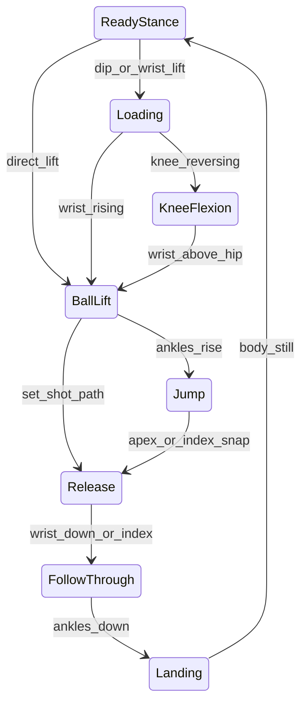

# Phase Detection

Finite state machine (FSM) that labels **where** the player is in the jump-shot sequence.

---

## Modules

| File | Role |
|------|------|
| `phase_detection/detector.py` | `ShotPhaseDetector` FSM |
| `phase_detection/features.py` | `KinematicFeatures` |
| `phase_detection/phases.py` | Order, transitions, labels |
| `config/phases.yaml` | Thresholds |

---

## The 8 Phases

| # | ID | Label | What happens |
|---|-----|-------|--------------|
| 1 | `ready_stance` | Ready Stance | Still before shot |
| 2 | `loading` | Loading | Hip/knee dip, ball low |
| 3 | `knee_flexion` | Knee Flexion | Bottom of dip |
| 4 | `ball_lift` | Ball Lift | Ball rising to set point |
| 5 | `jump` | Jump | Feet leave floor |
| 6 | `release` | Release | Ball leaves hand |
| 7 | `follow_through` | Follow-Through | Arm extends after release |
| 8 | `landing` | Landing | Feet return |

---

## FSM Diagram



**Set shot path:** `ball_lift → release` without jump when elbow extends and wrist drives through.

---

## Stability (No Flicker)

From `config/phases.yaml`:

| Setting | Default | Purpose |
|---------|---------|---------|
| `hysteresis_frames` | 5 | Consecutive frames agreeing before transition |
| `min_dwell_frames` | 3 | Minimum time in phase before leaving |

If the player **pauses** in a phase, no transition fires until movement triggers the next phase.

---

## Index Finger Signals

Landmarks: `left_index` / `right_index` (MediaPipe 19/20)

| Feature | Use |
|---------|-----|
| `index_align_angle` | elbow → wrist → index angle |
| `index_velocity_y` | Finger drive at release |
| `index_y` | Height tracking |

Release transitions use index snap + elbow extension. Follow-through uses index alignment > 160° (gooseneck).

---

## KinematicFeatures

| Field | Meaning |
|-------|---------|
| `wrist_y`, `wrist_velocity_y` | Shooting hand height/speed |
| `index_y`, `index_velocity_y` | Index finger kinematics |
| `index_align_angle` | Finger-through-ball alignment |
| `ankle_y_avg`, `ankle_baseline_y` | Jump detection |
| `knee_angle`, `knee_angle_delta` | Load and extension |
| `hip_velocity_y` | Loading dip |
| `elbow_angle` | Slot, release, follow-through |
| `nose_velocity_y` | Head stability (rules) |
| `total_velocity` | Stillness for ready_stance |

---

## Tuning `phases.yaml`

**Phases switch too early:** increase `hysteresis_frames`, `min_dwell_frames`, or raise velocity thresholds.

**Phases switch too late:** decrease hysteresis or lower thresholds.

Test on [`assets/videos/video_07_side_jump_shot.mp4`](../assets/videos/video_07_side_jump_shot.mp4) (side view).

---

## Pipeline

```python
features = extract_features(world, angles, shooting_side, prev_world, ...)
phase = self._phase_detector.update(features)
```

---

## Related

- [BIOMECHANICS.md](BIOMECHANICS.md) — rules gated by phase
- [FEEDBACK_SCORING.md](FEEDBACK_SCORING.md) — shot boundaries use phases
- [PHASES_OVERVIEW.md](PHASES_OVERVIEW.md)
