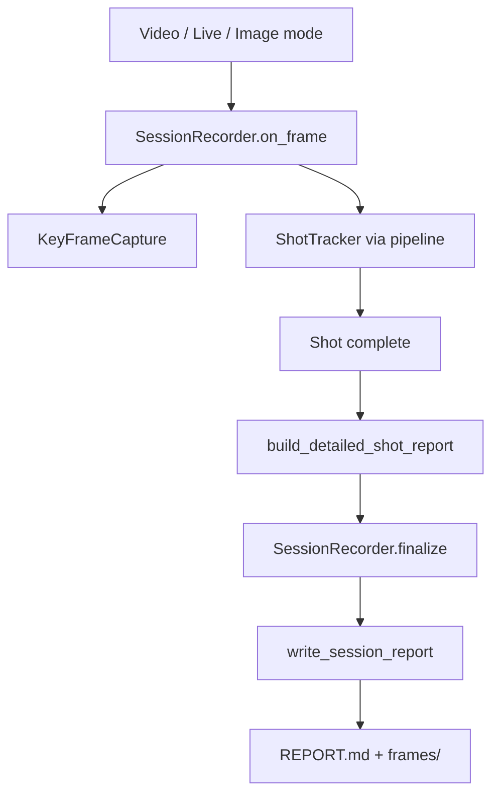

# Detailed Session Reports

Swichy generates a **PDF report** with **embedded annotated key frames** after every video, live webcam session, or single-image analysis. The same reporting pipeline applies to all modes.

---

## What You Get

After a session ends, Swichy saves:

```
outputs/reports/{session_id}/
├── REPORT.pdf         # Full form analysis (PDF with images)
└── frames/
    ├── shot_01_frame_00042_release.jpg
    ├── shot_01_frame_00058_release.jpg   # worst violation frame
    └── ...
```

### REPORT.pdf includes

1. **Session overview** — source, FPS, shot count, overall score/grade
2. **Strengths** — rules passed consistently across shots
3. **Priority improvements** — most frequent failures across the session
4. **Per-shot breakdown**
   - Coach summary (coaching tips)
   - Phase timeline (when each phase occurred)
   - Full form checklist (every rule with measured value, range, rationale)
   - **Key frames** — images embedded with explanations

Set `save_markdown_copy: true` in [`config/report_config.yaml`](../config/report_config.yaml) to also save `REPORT.md`.

### Key frame images

Each saved frame is annotated with:

- Phase and timestamp header
- **"IMPROVE HERE"** callout listing issues on that frame
- Angle summary at the bottom

---

## How Key Frames Are Selected

During each shot, `KeyFrameCapture` records:

| Trigger | When |
|---------|------|
| **Priority phases** | First frame of `loading`, `ball_lift`, `release`, `follow_through`, `landing` |
| **Violations** | Worst frame per failed rule (largest distance from ideal range) |

Up to `max_key_frames_per_shot` frames are kept (default: 12). Configure in [`config/report_config.yaml`](../config/report_config.yaml).

---

## Architecture



### Module roles

| Module | Role |
|--------|------|
| `feedback/session_recorder.py` | Collects frames and shots across a session |
| `feedback/frame_capture.py` | Selects informative key frames per shot |
| `feedback/report_builder.py` | Builds `DetailedShotReport` and `SessionReport` |
| `feedback/report_writer.py` | Saves markdown + annotated JPGs |
| `feedback/report_models.py` | Data models for reports |
| `visualization/report_frame.py` | Draws issue callouts on saved frames |

---

## Configuration

[`config/report_config.yaml`](../config/report_config.yaml):

```yaml
max_key_frames_per_shot: 12
store_frame_images_during_shot: true
auto_save_report: true
```

- **`auto_save_report`** — when `true`, reports are saved automatically to `outputs/reports/` when a session ends
- **`REPORT_OUTPUT_DIR`** — override path in [`config/settings.py`](../config/settings.py)

---

## Usage

Reports are generated automatically — no extra flags needed.

```powershell
.\venv\Scripts\activate
python main.py   # set MODE in main.py: video | live | image
```

When the session ends (video finishes, press `q` in live/video, or close image window):

```
Detailed report saved: outputs/reports/20250616_143022_a1b2c3/REPORT.pdf
  Key frames: outputs/reports/20250616_143022_a1b2c3/frames
```

Open `REPORT.pdf` in any PDF viewer. Frame images and explanations are embedded in the document.

---

## Applying Feedback Across Modes

| Mode | What gets reported |
|------|-------------------|
| **Video** | All detected shots + key frames per shot |
| **Live** | All shots during the webcam session |
| **Image** | Single-shot snapshot with form checklist and one key frame |

The **same rule checklist and coaching rationale** apply everywhere — only the number of shots and key frames differ.

---

## Related docs

- [FEEDBACK_SCORING.md](FEEDBACK_SCORING.md) — how shot scores and tips are computed
- [BIOMECHANICS.md](BIOMECHANICS.md) — rule definitions and rationale text in reports
- [PHASE_DETECTION.md](PHASE_DETECTION.md) — phase timeline in reports
