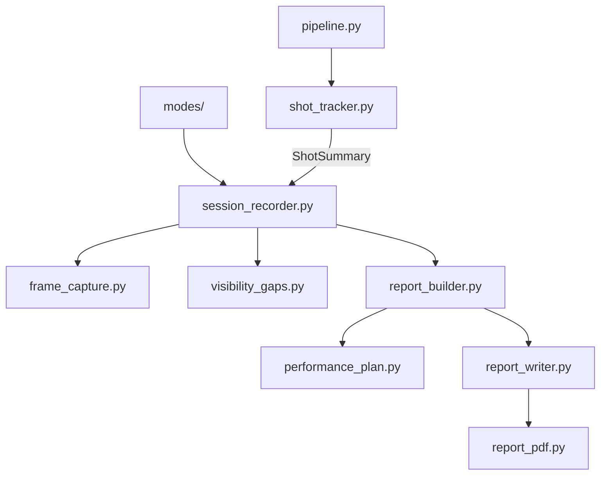

# Detailed Session Reports

Swichy writes a **PDF performance report** after every video, live session, or image analysis. Reports focus on **what to fix next** and **which drills to run**, not just raw scores.

---

## Output Location

```
outputs/reports/{session_id}/
├── REPORT.pdf              # Primary deliverable
└── frames/
    ├── shot_01_frame_00042_release.jpg
    └── ...
```

Optional: set `save_markdown_copy: true` in [`config/report_config.yaml`](../config/report_config.yaml) for `REPORT.md`.

---

## PDF Structure

### Title page
- Overall score and grade
- **Strengths** — rules passed across shots
- **Priority improvements** — most common failures
- **Capture notes** — shots that started mid-rep or ended early
- **Your practice plan** — session-level drills (from `performance_plan.py`)
- How to use the report

### Per shot
| Section | Content |
|---------|---------|
| **Capture status** | Mid-entry warning, missing phases, reliability note |
| **Next rep focus** | Top 1–2 corrections for the next attempt |
| **Drills for this shot** | Specific exercises per failed rules |
| **Action items** | Step-by-step improvements |
| **Coach summary** | Coaching tips |
| **Phase timeline** | When each phase occurred |
| **Tracking reliability** | Periods when elbow/knee/index/etc. were occluded |
| **Form checklist** | Every rule: measured value, range, rationale |
| **Key frames** | Embedded annotated images |

---

## Mid-Shot Entry in Reports

If video or live stream **starts during** loading/jump/release (not from ready stance):

1. `ShotTracker` begins recording immediately (`started_mid_phase=True`)
2. Phases from that point through landing are still detected and scored
3. PDF **Capture Status** explains what was not on camera
4. Rules for missing phases are simply not evaluated (not penalized)

Example note:
> Recording started mid-shot at Jump. Earlier phases were not captured. Missing from start: Ready Stance, Loading, Knee Flexion, Ball Lift.

---

## Key Frame Selection

`feedback/frame_capture.py` during each shot:

| Trigger | When |
|---------|------|
| Priority phases | First frame of loading, ball_lift, release, follow_through, landing |
| Violations | Worst frame per failed rule (furthest from ideal range) |

Max frames: `max_key_frames_per_shot` in `report_config.yaml` (default 12).

Annotated by `visualization/report_frame.py` with "IMPROVE HERE" callouts.

---

## Visibility Gap Notes

`feedback/visibility_gaps.py` tracks when landmarks stay unreliable longer than `VISIBILITY_HOLD_FRAMES` (default 5).

Report example:
> 00:01.20 → 00:01.65 during Release: could not reliably see the shooting elbow (8 frames below confidence threshold)

---

## Architecture



| Module | Role |
|--------|------|
| `session_recorder.py` | Per-frame collection across session |
| `frame_capture.py` | Key frame selection |
| `visibility_gaps.py` | Occlusion period notes |
| `report_builder.py` | `DetailedShotReport`, `SessionReport` |
| `performance_plan.py` | Drills, action items, capture notes |
| `report_pdf.py` | PDF layout + embedded images |
| `report_writer.py` | Write to `outputs/reports/` |

---

## Configuration

[`config/report_config.yaml`](../config/report_config.yaml):

```yaml
max_key_frames_per_shot: 12
store_frame_images_during_shot: true
auto_save_report: true
save_markdown_copy: false
```

[`config/settings.py`](../config/settings.py) → `REPORT_OUTPUT_DIR`

---

## Usage

```powershell
.\venv\Scripts\activate
python main.py   # MODE = video | live | image
```

End session (video ends, press `q`, or close image window):

```
Detailed report saved: outputs/reports/.../REPORT.pdf
```

---

## By Mode

| Mode | Report content |
|------|----------------|
| **Video** | All detected shots + key frames |
| **Live** | All shots during webcam session |
| **Image** | Single-shot checklist + one key frame |

Same rules and rationale apply in all modes.

---

## Related

- [FEEDBACK_SCORING.md](FEEDBACK_SCORING.md)
- [BIOMECHANICS.md](BIOMECHANICS.md)
- [MANUAL_COMPLETION_GUIDE.md](MANUAL_COMPLETION_GUIDE.md)
