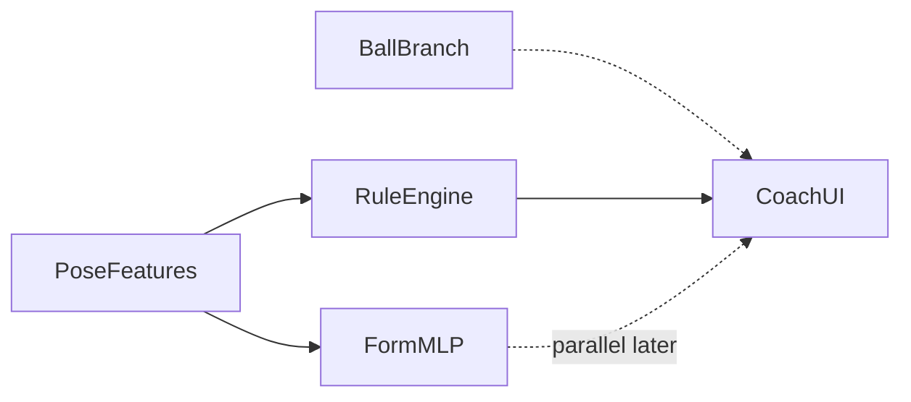

# Form ML and the Rule Engine

**Status:** Form-first training is ready for Salah. Live coaching still uses the rule engine.  
**Related:** [SALAH_MISSION.md](SALAH_MISSION.md) (how to train) · [PHASE_6_BALL_AND_OUTCOME.md](../../docs/PHASE_6_BALL_AND_OUTCOME.md) (ball track)

This document explains how Swichy keeps **fixed biomechanics rules** and a **learnable form MLP** side by side, why form labels matter more than make/miss for v1, and what is deferred.

---

## 1. Design choice (why form MLP, not auto-tuning YAML)

| Approach | Role in Swichy |
|----------|----------------|
| **Form MLP (chosen)** | Learns shot-form quality from Salah’s labeled videos. Works when the hoop or ball is missing. |
| **Fixed rule engine (kept)** | Expert ranges in `config/biomechanics.yaml`. Explainable tips per phase. Unchanged by training. |
| **Auto-tune YAML thresholds (deferred)** | Needs per-rule labels and a large clean set. Does not replace overall form judgment. Do this only after the form dataset is large. |

Training **never** edits `analysis/` or `biomechanics.yaml`. The MLP is a parallel judge, not a silent replacement.

---

## 2. How the live system works (inference)

One frame flows through two branches. They meet in `pipeline.FrameResult`.

```text
One video / camera frame
        │
        ├─ Pose branch (always on)
        │     MediaPipe → One Euro filter → visibility → 3D angles
        │           → kinematic features → phase FSM
        │                 ├─ Rule engine (biomechanics.yaml)
        │                 │     → pass/fail tips + form score 0–100
        │                 └─ Form MLP (future live hook)
        │                       → class_id + confidence
        │                       [checkpoint: ml/checkpoints/best_model.pt]
        │
        └─ Ball branch (when ball.yaml enabled)
              YOLO ball + rim → tracker → time series
                    → trajectory / make-miss / speed proxies
                    → often "unknown" if hoop not visible
```

### What each piece answers

| Question | Source today | Source after MLP is wired live |
|----------|--------------|--------------------------------|
| Was technique good? | Rule score + tips | Rules **and** MLP class (compare) |
| Which phase is this? | Phase FSM | Same |
| Did the ball go in? | Ball outcome (when possible) | Same (optional) |
| Ball speed / path / “force”? | Trajectory proxies | Same (optional, not lab force) |

**Product rule until proven otherwise:** show the rule-engine coach in the app; keep MLP offline or parallel for comparison. Soft-replace UX only after holdout metrics say the MLP wins.

---

## 3. How training works (offline, Salah)

Form training does **not** need make/miss or a visible hoop.

```text
ml/datasets/videos/train/*.mp4
        +
labels.csv   (class_id = form quality — REQUIRED)
        │
        ▼
python -m ml.datasets.build_features_from_videos
        │
        ▼
ml/datasets/data/train.npz
   features: (N, 33) float32   ← pose / angles / phases only
   labels:   (N,)    int64     ← class_id only
        │
        ▼
python -m ml.training.train
        │
        ▼
ml/checkpoints/best_model.pt
ml/tensorboard/<experiment_name>/
```

### Important properties

- Target label = **player form** (`class_id` 0–4), not made/miss.
- Player-only side views are valid training data.
- Optional CSV columns `made`, `has_hoop` go into `.meta.json` only; the form trainer ignores them.
- `--with-ball` can add ball side metrics to meta for later analysis; it does **not** change the MLP target.
- Synthetic `data.source: synthetic` remains available only as a pipeline smoke test.

### Quick commands

```powershell
cd C:\path\to\Swichy
.\venv\Scripts\Activate.ps1

# 1) Put MP4s in ml/datasets/videos/train/ and edit labels.csv
# 2) Export form features
python -m ml.datasets.build_features_from_videos `
  --videos ml/datasets/videos `
  --labels ml/datasets/videos/labels.csv `
  --output ml/datasets/data/train.npz

# Optional: also run YOLO ball/rim for meta side stats
#   ... --with-ball

# 3) Train form MLP (reads ml/configs/train.yaml)
python -m ml.training.train

# 4) Watch curves
tensorboard --logdir ml/tensorboard
```

---

## 4. How ML and the rule engine work together



| Stage | Rule engine | Form MLP |
|-------|-------------|----------|
| **Today (live app)** | Active coach | Train offline; checkpoint ready |
| **Next** | Still active | Load `best_model.pt` beside rules; log both |
| **Later** | Soften or keep as tips | Prefer MLP if holdout metrics win |

### Comparison protocol (before changing product UX)

1. Hold out the same labeled shots (human `class_id`).
2. Map rule score 0–100 → five form classes (same map as `score_to_class` in the exporter), **or** compare rank correlation of score vs class.
3. Report accuracy / macro-F1 for MLP vs rules on that holdout.
4. Only then change what the player sees.

Until that comparison is done, training must not delete or overwrite the rule path.

---

## 5. Optional ball / physics (secondary)

Many videos show the player but not the hoop, or the ball flight after release. That is normal.

| Signal | When available | Blocks form training? |
|--------|----------------|----------------------|
| Ball + rim boxes | Camera sees them + `--with-ball` / live `ball.yaml` | No |
| Make / miss | Hoop visible + enough flight frames | No — use `unknown` |
| Ball speed / path curve | Trajectory fit on flight window | No |
| “Force from person” | **Proxy only** (peak ball / wrist speed near release) | No — not force plates |

Human label `made` in `labels.csv` is optional. Leave blank when you cannot see the result. Form `class_id` is still enough to train.

---

## 6. Labels (form-first)

Required:

| Column | Meaning |
|--------|---------|
| `video_path` | Path relative to `ml/datasets/videos/`, repo root, or absolute |
| `shot_index` | `0`, `1`, … or `*` for every shot in that file |
| `class_id` | Form: `0` excellent, `1` good, `2` fair, `3` poor, `4` major error |

Optional (blank = ignore):

| Column | Meaning |
|--------|---------|
| `made` | `1` / `0` if result is visible |
| `has_hoop` | `1` / `0` |
| `notes` | Free text |

See [../datasets/videos/README.md](../datasets/videos/README.md) and `labels.example.csv`.

---

## 7. Deferred work (do not block Salah)

- Multi-task MLP that jointly predicts make/miss + form (needs many complete hoop videos).
- Automatic search / rewrite of every `biomechanics.yaml` threshold.
- True biomechanical force without calibrated physics.
- Replacing the live rule coach in `pipeline.py` before holdout comparison.

When the form set is large (hundreds → thousands of labeled shots), revisit: hybrid score (rules + MLP), then optional rule calibration.

---

## 8. Code map

| Piece | Path |
|-------|------|
| Live pose + rules + optional ball | `pipeline.py` |
| Fixed rules | `analysis/`, `config/biomechanics.yaml` |
| Form feature export | `ml/datasets/build_features_from_videos.py` |
| Dataset loader | `ml/datasets/feature_dataset.py` |
| MLP | `ml/models/mlp.py` |
| Train loop | `ml/training/train.py` |
| Hyperparameters | `ml/configs/train.yaml` |
| Ball / outcome | `ball/` |
| Salah how-to | `ml/docs/SALAH_MISSION.md` |
