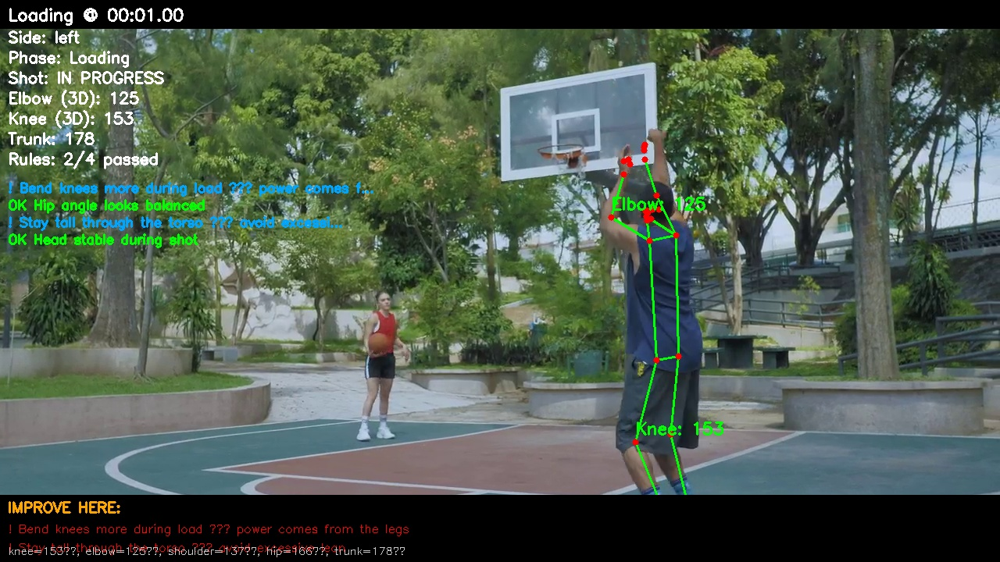
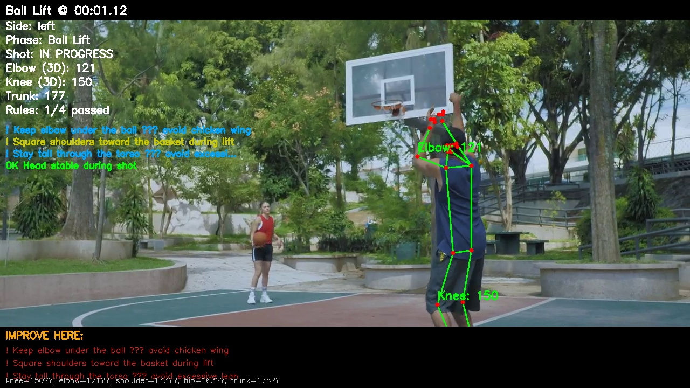
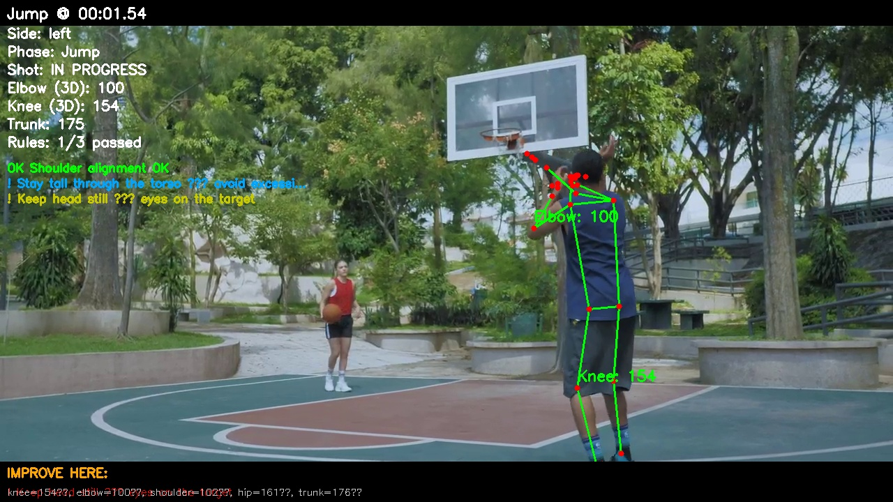
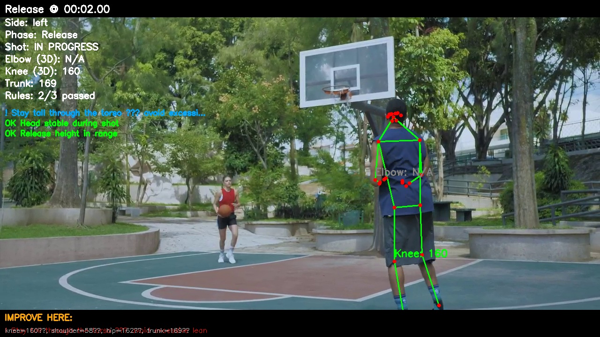
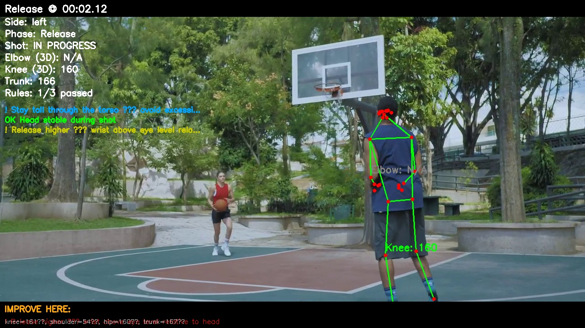
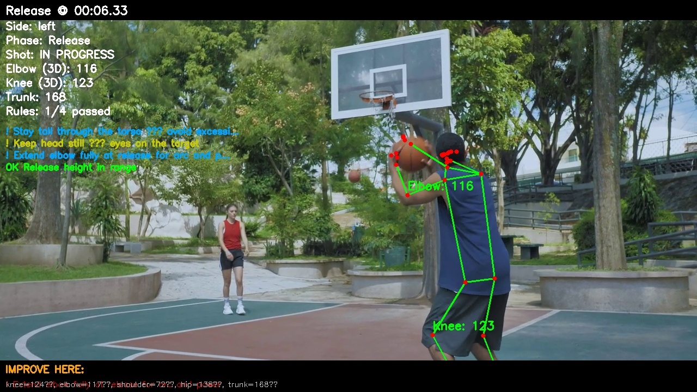
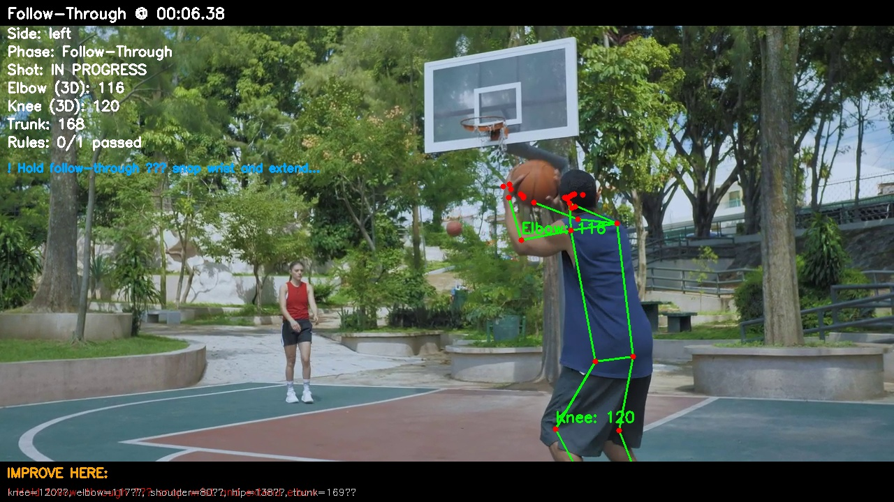
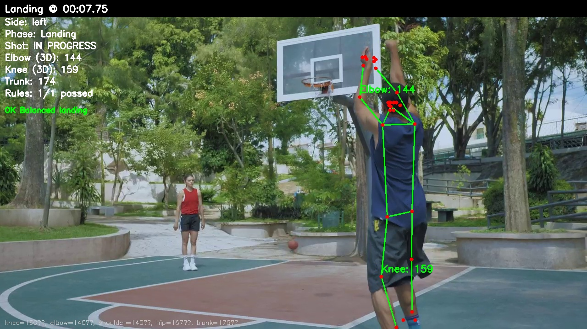

# Swichy — Shooting Form Analysis Report

## Session Overview

| Field | Value |
|-------|-------|
| Source | `test.mp4` |
| Type | video |
| Session ID | `20260616_193209_3a73bb` |
| FPS | 24.0 |
| Frames analyzed | 270 |
| Shots detected | 1 |
| Overall score | **13/100** (Needs Work) |

## Strengths

- Hip Hinge (passed in 1/1 shots)
- Landing Balance (passed in 1/1 shots)

## Priority Improvements

1. **Knee Flexion (Load) (failed in 1/1 shots)**
2. **Trunk Posture (failed in 1/1 shots)**
3. **Elbow Position (Lift) (failed in 1/1 shots)**
4. **Elbow Extension (Release) (failed in 1/1 shots)**
5. **Follow-Through (failed in 1/1 shots)**

---

## Shot-by-Shot Analysis

### Shot #1 — Needs Work (13/100)

- **Time:** 00:01.00 → 00:09.04
- **Rules passed:** 2/10
- **Phases detected:** loading, ball_lift, jump, release, follow_through, landing, ready_stance

#### Coach Summary

- Bend knees more during load — power comes from the legs
- Stay tall through the torso — avoid excessive lean
- Keep elbow under the ball — avoid chicken wing
- Break the shot into phases and practice each slowly.

#### Phase Timeline

| Time | Phase | Frame |
|------|-------|-------|
| 00:01.00 | Loading | 24 |
| 00:01.12 | Ball Lift | 27 |
| 00:01.50 | Jump | 36 |
| 00:02.00 | Release | 48 |
| 00:06.38 | Follow-Through | 153 |
| 00:07.75 | Landing | 186 |

#### Form Checklist

- **[FAIL]** Knee Flexion (Load) — measured `153.5` (range 70–130)
  - Bend knees more during load — power comes from the legs
  - *Why:* Adequate knee flexion stores elastic energy for the jump
  - See frame: `frames/shot_01_frame_00024_loading.jpg`

- **[FAIL]** Trunk Posture — measured `178.3` (range 5–25)
  - Stay tall through the torso — avoid excessive lean
  - *Why:* Controlled trunk lean maintains balance through the shot
  - See frame: `frames/shot_01_frame_00048_release.jpg`

- **[FAIL]** Elbow Position (Lift) — measured `121.4` (range 70–120)
  - Keep elbow under the ball — avoid chicken wing
  - *Why:* Elbow under the ball stabilizes the shooting path
  - See frame: `frames/shot_01_frame_00027_ball_lift.jpg`

- **[FAIL]** Elbow Extension (Release) — measured `121.6` (range 155–180)
  - Extend elbow fully at release for arc and power
  - *Why:* Near-full extension at release maximizes arc and follow-through
  - See frame: `frames/shot_01_frame_00152_release.jpg`

- **[FAIL]** Follow-Through — measured `116.9` (range 150–180)
  - Hold follow-through — snap wrist and extend elbow
  - *Why:* Follow-through ensures backspin and consistent arc
  - See frame: `frames/shot_01_frame_00153_follow_through.jpg`

- **[FAIL]** Head Stability — measured `0.1` (range ≤ 0.08)
  - Keep head still — eyes on the target
  - *Why:* Head movement shifts aim and disrupts consistency
  - See frame: `frames/shot_01_frame_00037_jump.jpg`

- **[FAIL]** Shoulder Alignment — measured `133.4` (range 60–120)
  - Square shoulders toward the basket during lift
  - *Why:* Shoulder orientation affects shot direction consistency
  - See frame: `frames/shot_01_frame_00027_ball_lift.jpg`

- **[FAIL]** Release Height — measured `0.7` (range 0.15–0.55)
  - Release higher — wrist above eye level relative to head
  - *Why:* Higher release point is harder to block and improves arc
  - See frame: `frames/shot_01_frame_00051_release.jpg`

- **[PASS]** Hip Hinge — measured `166.3` (range 140–175)
  - Hip angle looks balanced
  - *Why:* Hip-shoulder-knee chain transfers force from legs to upper body

- **[PASS]** Landing Balance — measured `0.0` (range ≤ 0.06)
  - Balanced landing
  - *Why:* Controlled landing indicates balanced shot mechanics

#### Key Frames — Where to Improve

##### Key phase: Loading @ 00:01.00

- **Phase:** Loading
- **Frame:** 24
- **Angles:** knee=153°, elbow=125°, shoulder=137°, hip=166°, trunk=178°
- **Issues on this frame:**
  - Bend knees more during load — power comes from the legs
  - Stay tall through the torso — avoid excessive lean

##### Key phase: Ball Lift @ 00:01.12

- **Phase:** Ball Lift
- **Frame:** 27
- **Angles:** knee=150°, elbow=121°, shoulder=133°, hip=163°, trunk=178°
- **Issues on this frame:**
  - Keep elbow under the ball — avoid chicken wing
  - Square shoulders toward the basket during lift
  - Stay tall through the torso — avoid excessive lean

##### Issue: Head Stability @ 00:01.54

- **Phase:** Jump
- **Frame:** 37
- **Angles:** knee=154°, elbow=100°, shoulder=102°, hip=161°, trunk=176°
- **Issues on this frame:**
  - Keep head still — eyes on the target

##### Key phase: Release @ 00:02.00

- **Phase:** Release
- **Frame:** 48
- **Angles:** knee=160°, shoulder=58°, hip=162°, trunk=169°
- **Issues on this frame:**
  - Stay tall through the torso — avoid excessive lean

##### Issue: Release Height @ 00:02.12

- **Phase:** Release
- **Frame:** 51
- **Angles:** knee=161°, shoulder=54°, hip=160°, trunk=167°
- **Issues on this frame:**
  - Release higher — wrist above eye level relative to head

##### Issue: Elbow Extension (Release) @ 00:06.33

- **Phase:** Release
- **Frame:** 152
- **Angles:** knee=124°, elbow=117°, shoulder=72°, hip=138°, trunk=168°
- **Issues on this frame:**
  - Extend elbow fully at release for arc and power

##### Key phase: Follow-Through @ 00:06.38

- **Phase:** Follow-Through
- **Frame:** 153
- **Angles:** knee=120°, elbow=117°, shoulder=80°, hip=138°, trunk=169°
- **Issues on this frame:**
  - Hold follow-through — snap wrist and extend elbow

##### Key phase: Landing @ 00:07.75

- **Phase:** Landing
- **Frame:** 186
- **Angles:** knee=160°, elbow=145°, shoulder=145°, hip=167°, trunk=175°

---

## How to Use This Report

1. Start with **Priority Improvements** — fix the most frequent issues first.
2. Open **Key Frames** — each image shows exactly when and where form broke down.
3. Use the **Phase Timeline** to understand shot sequencing.
4. Re-record and compare overall score across sessions.

*Generated by Swichy AI Basketball Coach*